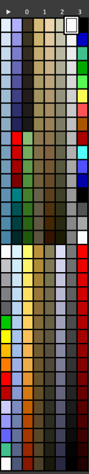

# VXL Parser

支持将 MagicaVoxel(.vox) 体素与 TiberumSun/RedAlert2(.vxl) 体素互相转换，并保留色盘。

此工具的色盘转换功能基于直接数据索引，不需要经过 VXLSE III 使用的切片颜色匹配。理论上本工具可完美保留相近色（如亮光红不会被解析为所属色），且不会受MagicaVoxel色盘干扰（你可以用不同的所属色作画）。

此工具默认使用的优化色盘如截图所示：



此色盘自心灵终结中使用的拓展了尾区的 uniturb.pal 转换（应用了坐标变换以使颜色分布与VXLSE近似）。你可以手动根据 pal 文件解析。

使用方式：
需求: 需要首先安装 Bun

```sh
bun ${tool_dir}/src/main.ts ${from_type}-${to_type} ${input_file} ${output_file}
```
`tool_dir` 为该项目的地址， `from_type` 代表转换前的格式，`to_type` 代表转换的目标格式。 `input_file` 代表要转换的文件路径， `output_file` 代表输出文件路径。

例如：我想要把当前目录下面的 myartwork.vox 转换为 myartwork.vxl ，且本项目位于 `D:\vxl-parser`，那么便需要执行 `bun D:\vxl-parser\src\main.ts vox-vxl myartwork.vox myartwork.vxl`。

该工具在运行时会读取工作目录下的 parser.json ，该文件是可选的JSON格式文件。该文件有如下字段：
*   `autonormal`: `boolean`，指定是否启用自动法线。默认 `true` 。
*   `normalrange`: `number`，指定自动法线算法应用的半径，默认 `3.5`。
*   `palettetransform`: `boolean`，指定是否对vox文件应用色盘转换。该转换算法以上图中使用的色盘进行反向变换。